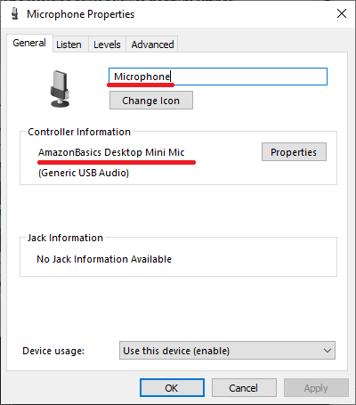

<h1 align="center">
  AHK_MicMute
</h1>

  Control your microphone using keyboard/mouse shortcuts.

## Usage
On the first run of the application, a config file will open in notepad that will look like this:
        
    [settings]
    Device_Name=""
    Mute_Hotkey=""
    Unmute_Hotkey=""
    Sound_Feedback=""
    OnScreen_Feedback=""
### 
`Device_Name=""` can be any substring of your microphone's name or the controller's name as shown in this image:

image

### 
`Mute_Hotkey=""` and `Unmute_Hotkey=""` both can be any hotkey supported by AHK, use this [List of keys](https://www.autohotkey.com/docs/KeyList.htm) as reference. 

Examples: `"<^M"`, `"RShift"`, `"^!T"`

Note: If both are set to the same hotkey, it will act as a toggle
### 

`Sound_Feedback=""` and `OnScreen_Feedback=""` can be set to either `"0"` or `"1"`
### 

Example of a correct config

    [settings]
    Device_Name="AmazonBasics"
    Mute_Hotkey="RShift"
    Unmute_Hotkey="RShift"
    Sound_Feedback="1"
    OnScreen_Feedback="0"            

### You can always edit the config file by clicking on *Edit config* from the tray menu.

## Install using [Scoop](scoop.sh)

1. Install scoop using powershell
    
        iwr -useb get.scoop.sh | iex
2. Add my bucket to scoop
        
        scoop install git
        scoop bucket add utils https://github.com/SaifAqqad/utils.git
3. Install MicMute

        scoop install micmute

#### Note: If you Install the application using scoop, it will run at startup, you can disable this from task manager.